# MatrixOS — Architecture & Design

A single reference for how MatrixOS is built: the whole-app picture first, then a
section per view. Every concept has a **plain-English** explanation next to the
technical detail, and there's a [glossary](#glossary) at the end. Diagrams are
Mermaid (render in GitHub, VS Code, and MatrixOS's own markdown).

> **In plain words:** MatrixOS is a desktop app for building and running AI
> "agents" — little assistants you configure (which model, what tools, what they
> remember) — and for chaining them into multi-step "workflows." It talks to AI
> providers over the internet, can search the web and read files, and keeps a
> memory of past work.

## Contents
1. [The one big idea](#the-one-big-idea)
2. [High-Level Architecture](#high-level-architecture) (C1 / C2 / C3 + lifecycle)
3. [Data Model & Database](#data-model--database)
4. [Chat](#view--chat)
5. [Dashboard](#view--dashboard-observability)
6. [Agents](#view--agents)
7. [Workflows](#view--workflows)
8. [Knowledge & Library](#view--knowledge--library)
9. [Schedules & Settings](#view--schedules--settings)
10. [Glossary](#glossary)

---

## The one big idea

> **In plain words:** Your secret API keys (which cost money and grant access)
> never touch the part of the app that could leak them. They live in the locked
> "back room" (Rust); the visible UI only ever asks "is a key set?" — never sees
> the key itself.

**Technical:** All LLM/search HTTP egress happens in the **Rust backend**; the
**React/TypeScript** renderer reaches providers only through IPC commands and
learns at most *whether* a key is configured. This split shapes everything:

- **Rust owns** what only it can see or should hold: SSE stream internals (tokens, `finish_reason`, time-to-first-token), HTTP egress, the OS keychain, append-only DB writes, the scheduler.
- **TS owns** what's derivable from app state: the agent tool-loop, workflow DAG, delegation, memory retrieval, UI, aggregation.

---

## High-Level Architecture

MatrixOS is a **Tauri 2 desktop app**: a **React 19 + TypeScript** renderer (UI +
orchestration) over a **Rust** backend (transport, filesystem, processes), with
**SQLite** for state and a **vector database** for memory.

### C1 — System Context (who the app talks to)

> **In plain words:** The app sits between you and a handful of outside services
> — AI model providers, a web-search service, optional plug-in tool servers, and
> the open web — plus your own files.

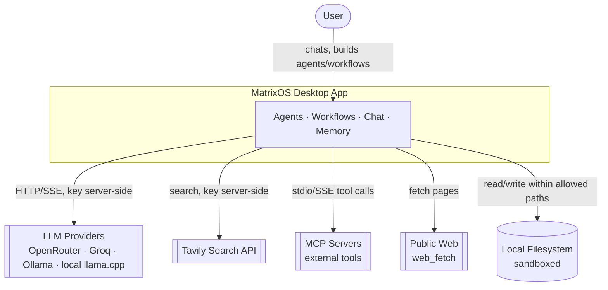

### C2 — Containers (the parts inside the app)

> **In plain words:** The app has two halves that talk over a private channel —
> the **screen** half (what you see and click, plus the logic that decides what
> to do) and the **engine** half (which actually calls the AI, holds the keys,
> and touches the network/disk). Two databases sit underneath: one for normal
> data, one for "memory" search.

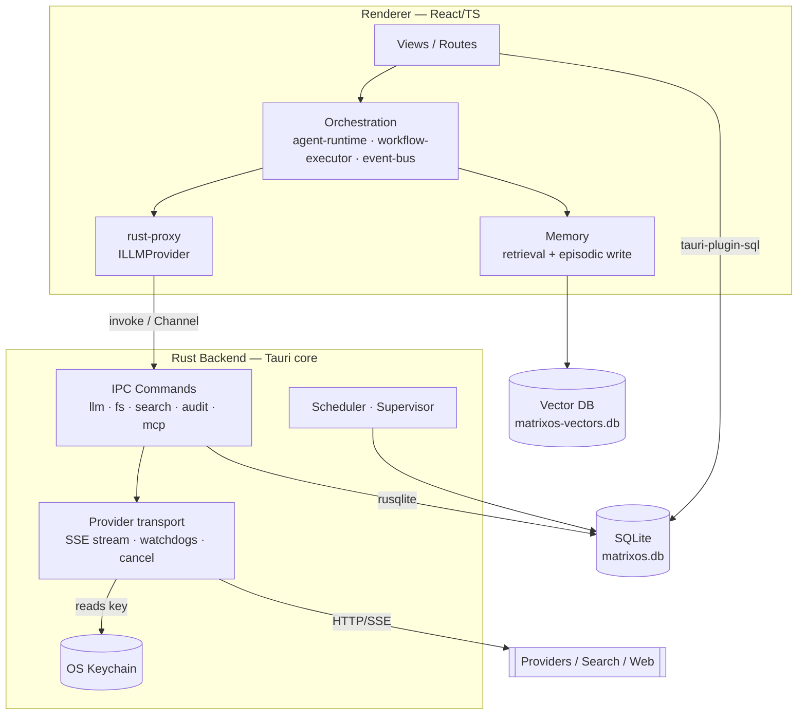

**Technical note:** Two DB access paths — the renderer uses `tauri-plugin-sql`,
Rust uses its own `rusqlite` connection (SQLite WAL allows both). The vector DB
is Rust-owned (`vec_search`).

### C3 — Components

> **In plain words:** Zoom into each half. The screen half has the views, the
> "stores" (live in-memory state), the orchestration brain (runs an agent's
> turn, runs workflows), memory, and tools. The engine half has command handlers
> grouped by job, the provider transport code, the databases, and the scheduler.

**Renderer (TypeScript):**

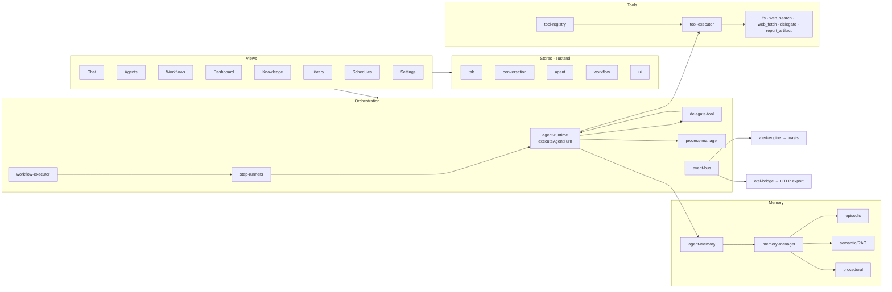

**Rust backend:**

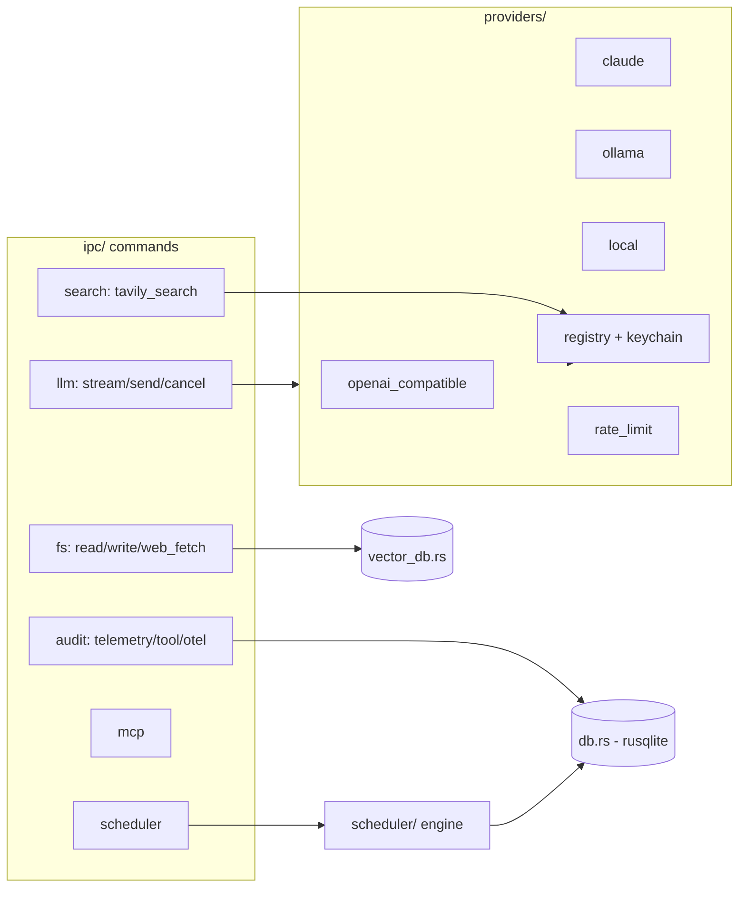

### One agent turn, end to end

> **In plain words:** When an agent "takes a turn," it (optionally) looks up
> relevant memories, then loops: ask the model, run any tools the model
> requested, feed results back, repeat — until the model gives a final answer.
> Each step is recorded so you can inspect it later.

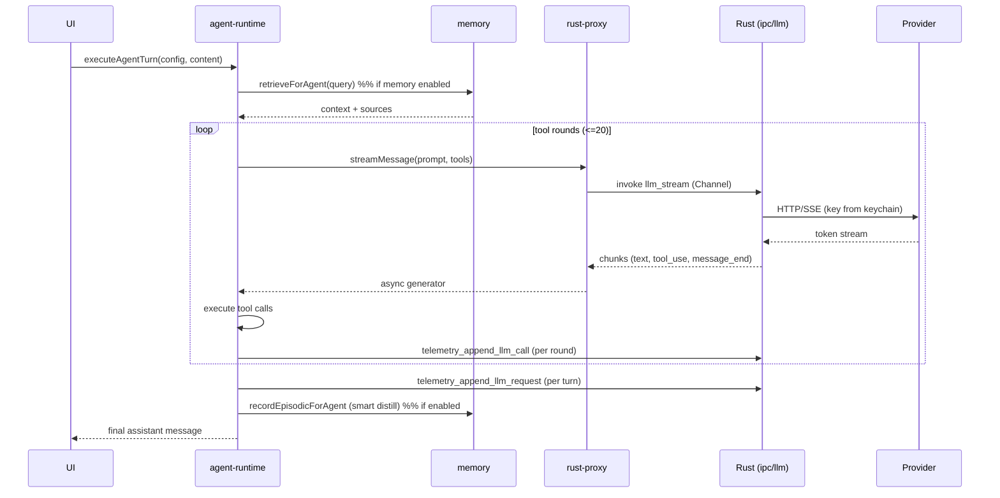

### Cross-cutting concerns

| Concern | Plain words | Where |
|---|---|---|
| Security (keys) | secrets stay in the back room | Rust keychain (providers + Tavily) |
| Observability | a flight recorder for every AI call | `llm_requests` (turn), `llm_calls` (round), `tool_executions`; event-bus → `alert-engine` (toasts) + `otel-bridge` (OTLP export) |
| Memory | the app remembers past work + your docs | `agent-memory` → `memory-manager`; runs on every path inside `executeAgentTurn`, opt-in per agent |
| Resilience | survives flaky providers + sloppy model output | provider fallbacks, stream watchdogs, delegation timeout, **tolerant tool-argument parsing** (bad JSON → retry, not crash), defensive JSON-column coercion |
| Data rule | no catalog/seed data hardcoded in source | bundled resources + idempotent seeders |

---

## Data Model & Database

> **In plain words:** Almost everything is stored in one local SQLite file; a
> second file holds the "meaning fingerprints" used for memory search. Big
> objects (an agent's full config, a workflow's flowchart) are saved as JSON
> text inside a single column.

**Two databases** (both local, in the app's data folder):
- **`matrixos.db`** — all relational state. Reached two ways: the renderer via
  `tauri-plugin-sql`, and Rust via its own `rusqlite` connection (SQLite WAL lets
  both run at once). **Schema version: 20** (migrations `001`–`020`).
- **`matrixos-vectors.db`** — the vector store (sqlite-vec). Rust-owned; queried
  with `vec_search`. Holds `vec_episodic` and `vec_semantic` virtual tables.

**Conventions**
- `*_json` columns hold serialized JSON in a TEXT column. Readers **defensively
  coerce** `string | Uint8Array | number[]` to a string before `JSON.parse`
  (CLAUDE.md §4) so a BLOB-stored row can't brick startup.
- **Append-only** tables enforce it with triggers (no UPDATE/DELETE):
  `llm_requests`, `llm_calls`*, `audit_log`; `daily_token_usage` blocks DELETE
  (UPSERT only). (*detail tables added in v20.)
- IDs are nanoids; timestamps are ISO-8601 strings supplied by the caller.

### Tables by domain

**Agents & conversations**

| Table | Purpose | Key columns |
|---|---|---|
| `agents` | One row per agent; the whole `AgentConfig` lives in `config_json` | `id`, `name`, `category`, **`config_json`** |
| `conversations` | A chat thread for an agent | `id`, `agent_id`, `title` |
| `messages` | Every message; supports retrieval sources + compaction | `id`, `conversation_id`, `role`, `content_json`, `telemetry_id`, `sources_json`, `is_summary`, `compacted_at` |
| `provider_configs` | Configured AI providers (keys are NOT here — keychain) | `id`, `type`, `base_url`, `enabled`, `config_json` |
| `preferences` | Key/value settings, per-agent or global | `key`+`agent_id` (PK), `value_json` |

**Observability / telemetry**

| Table | Purpose | Key columns |
|---|---|---|
| `llm_requests` | One row **per agent turn** (aggregated) | `id`, `agent_id`, `provider_id`, `model_id`, `prompt_json`, tokens, `tool_rounds`, `latency_ms`, `status`, `error_code`, `run_id`, `step_id`, `parent_request_id` |
| `llm_calls` | One row **per LLM round** within a turn | `id`, `request_id`, `turn_index`, `ttft_ms`, `latency_ms`, `finish_reason`, `prompt_json` |
| `tool_executions` | One row **per tool call** (args/result/sandbox) | `id`, `request_id`, `run_id`, `tool_name`, `args_json`, `result_json`, `status`, `sandbox_decision` |
| `daily_token_usage` | Per-agent/day token tally (rate-limit + cost) | `agent_id`+`date` (PK), tokens |
| `audit_log` | Append-only log of sensitive actions | `id`, `event_type`, `actor`, `target_*`, `details_json` |
| `alert_rules` | User alert rules (event or telemetry source) | `id`, `source`, `event_type`, `predicate_json`, `action`, `enabled` |

**Memory** (relational metadata; vectors live in `matrixos-vectors.db`)

| Table | Purpose | Key columns |
|---|---|---|
| `episodic_memories` | Distilled past-turn memories (+ pinning) | `id`, `agent_id`, `summary`, `pinned` → `vec_episodic` |
| `knowledge_documents` | Imported documents (RAG) | `id`, `name`, `file_type`, `file_path`, chunk/token counts |
| `document_chunks` | Chunked, embedded document text | `id`, `document_id`, `chunk_index`, `text`, `pinned` → `vec_semantic` |
| `knowledge_bases` / `knowledge_base_documents` | Named doc groups + membership | KB `id`/`name`; join `(knowledge_base_id, document_id)` |
| `procedural_templates` | Reusable how-to templates | `id`, `name`, `content`, `usage_count` |
| `embedding_config` | Current embedding provider/model/dims (singleton) | `provider`, `model`, `dimensions`, `base_url` |

**Library**

| Table | Purpose | Key columns |
|---|---|---|
| `agent_templates` | Bundled/custom agent presets | `id`, `name`, `system_prompt`, `icon`, `tags_json`, `origin`, `sort_order` |
| `skills` | Reusable prompt add-ons (bundled or custom) | `id`, `source_template_id`, `prompt`, `tags_json` |

**Workflows**

| Table | Purpose | Key columns |
|---|---|---|
| `workflows` | The flowchart definition (steps/edges/vars/triggers) | `id`, **`definition_json`** |
| `workflow_runs` | One run; live progress + results | `id`, `workflow_id`, `status`, `variables_json`, `step_results_json`, timing |
| `workflow_conversations` | Temp conversation per agent step | `conversation_id` (PK), `workflow_run_id`, `step_id` |
| `workflow_human_inputs` | Pending/answered human-input prompts | `id`, `run_id`, `step_id`, `input_type`, `response` |

**Scheduling & processes**

| Table | Purpose | Key columns |
|---|---|---|
| `scheduled_jobs` | Cron/agent schedules | `id`, `agent_id`, `cron_expression`, `timezone`, `prompt`, `target_conversation_id`, `enabled`, `next_run_at`, `consecutive_failures` |
| `schedule_run_history` | Each scheduled run's outcome | `id`, `job_id`, `status`, tokens, timing |
| `agent_processes` | In-flight/queued agent runs (priority, budget) | `id`, `agent_id`, `status`, `priority`, `token_budget_json`, `parent_workflow_run_id` |

**Integrations**

| Table | Purpose | Key columns |
|---|---|---|
| `mcp_servers` | Configured MCP tool servers (command/env in `transport_json`) | `id`, `name`, `transport_json`, `enabled` |

### Key relationships

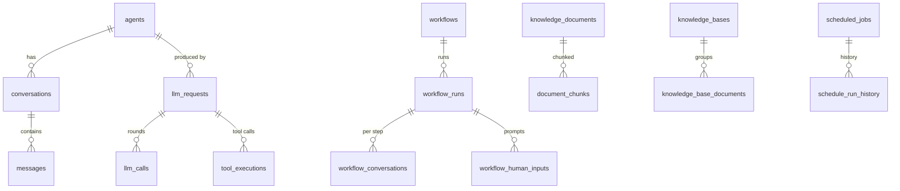

---

## View — Chat

> **In plain words:** The chat screen. Pick an agent, type a message, watch it
> reply token-by-token while it runs tools, thinks, hands work to other agents,
> and cites what it remembered. You can have several chats open in tabs at once.

### Component tree

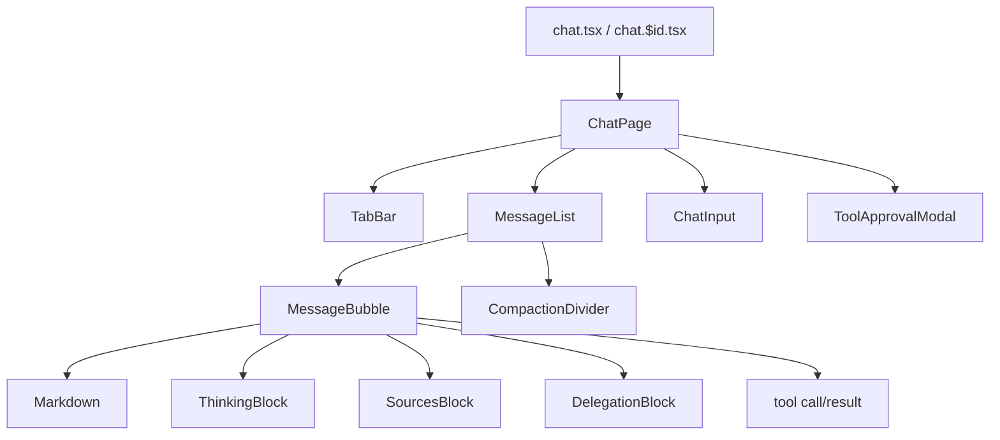

### How sending a message works

> **In plain words:** When you hit send, the app checks the agent's provider has
> a key, starts tracking the run, and kicks off the agent's turn. As the reply
> streams in, it updates the on-screen tab live — even if you switch to another
> tab (it'll flag "needs attention" when done).

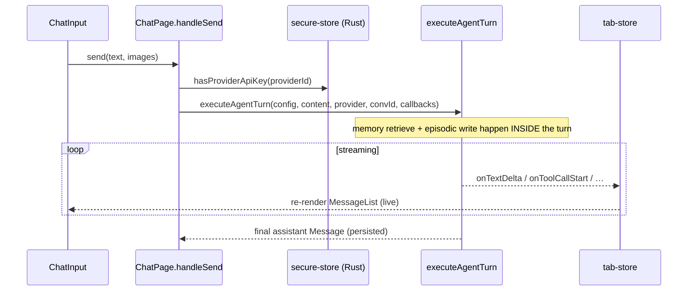

- **Stores:** `tab-store` (per-tab messages + live stream), `conversation-store`, `agent-store`, `settings-store`, `approval-store`, `ui-store`.
- **Touches:** Rust `llm_stream`, `provider_has_key`, tool commands; DB `conversations`, `messages`. Memory runs inside `executeAgentTurn` (the same runtime workflows use).

---

## View — Dashboard (Observability)

> **In plain words:** A read-only "flight recorder" dashboard. Shows how many AI
> calls happened, how many tokens, how fast, how often they failed, and the
> estimated cost. Click any request or tool call to inspect exactly what
> happened — even re-run a call against a different model.

### Component tree

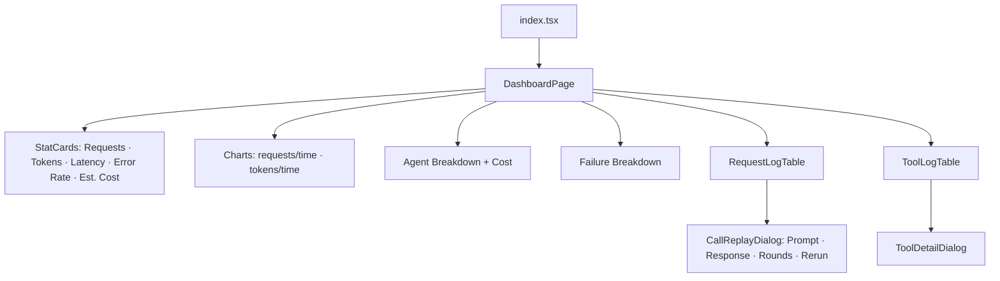

### Where the numbers come from

> **In plain words:** Each AI turn is logged as a row; each round within it and
> each tool call get their own rows. The dashboard reads and joins these. Cost is
> worked out on the fly from each model's price (never stored, so it's never
> stale).

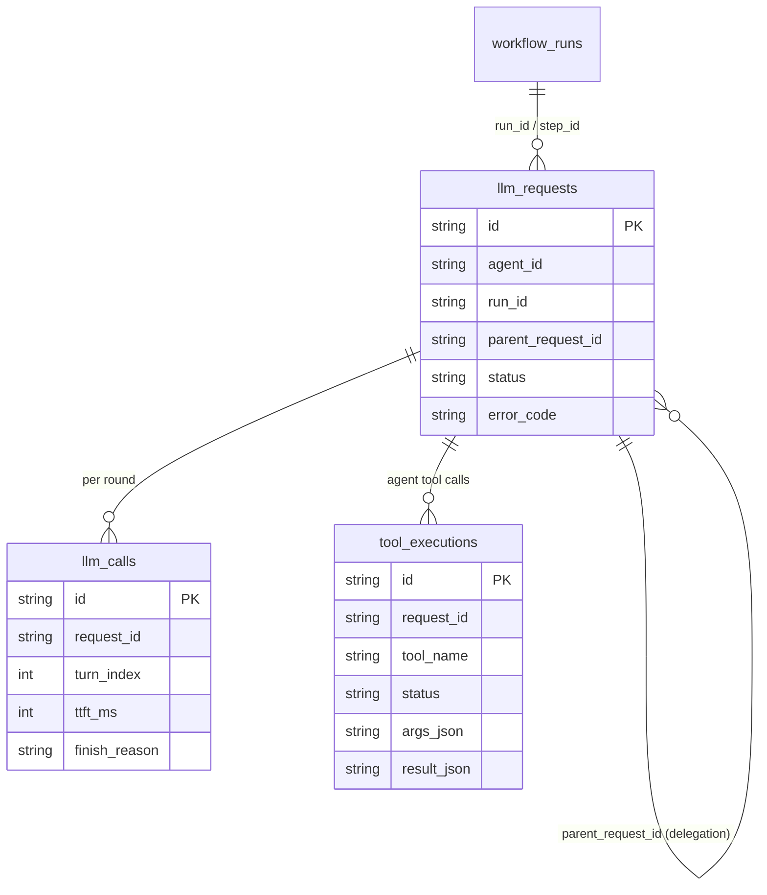

- One `llm_requests` row = one whole turn; `llm_calls` = per-round detail; `tool_executions` = each tool call. Joins resolve **agent** and **workflow** names.
- **Touches:** DB telemetry tables + `agents`/`workflow_runs`/`workflows`; Rust `llm_send` (for Rerun); event-bus `conversation:message_added` (live refresh).

---

## View — Agents

> **In plain words:** Where you create and edit agents. An agent is a saved
> recipe: which model, what it's told to do (system prompt), which tools/skills
> it can use, what it remembers, and whether it can hand work to other agents.
> You can also export an agent to share — without leaking your keys.

### Routes → components

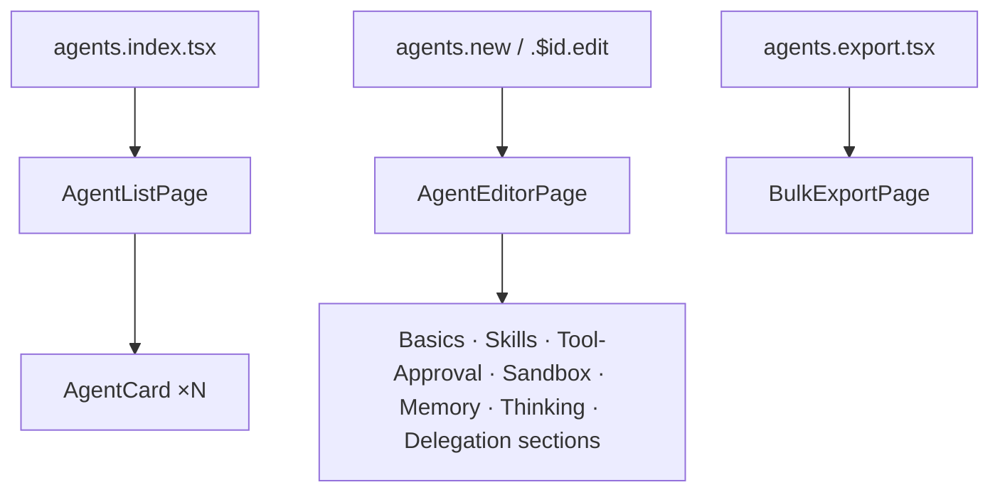

### The unsaved-edits draft

> **In plain words:** While editing, your half-finished changes are kept in
> memory so you don't lose them if you click away — but they vanish if you close
> the app (they're not saved to disk until you hit Save).

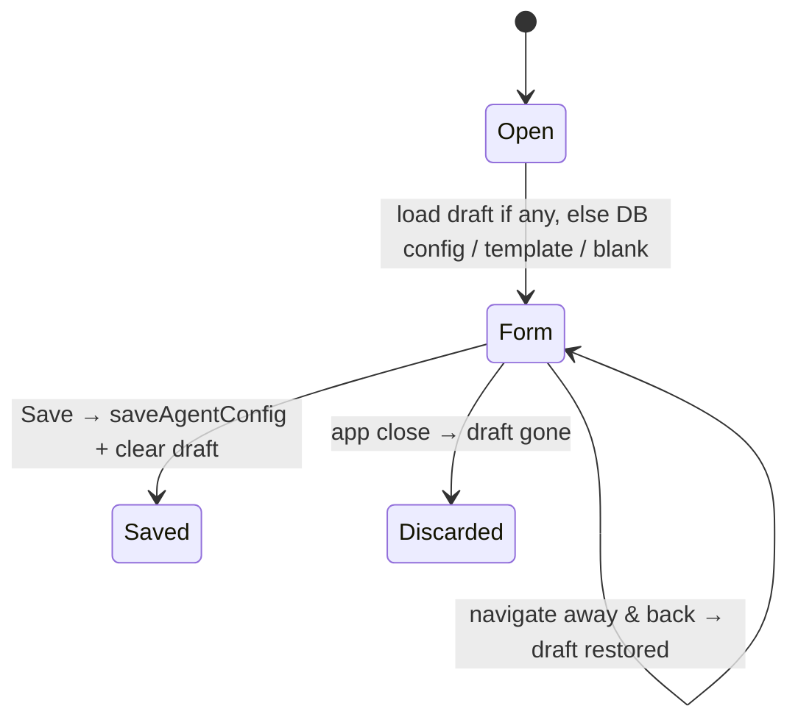

> **Technical gotcha:** Save writes the **entire** config. If a script changed
> the DB row mid-session and your open form is stale, saving overwrites that
> change. Not a risk across restarts (editor reloads from DB; drafts are
> in-memory only).

### Export is portable + key-free

> **In plain words:** An exported agent carries its behavior and skills but
> **not** your provider or API key — so sharing it can't leak credentials. The
> person importing binds it to their own provider.

- **Touches:** DB `agents` (`config_json`), `skills`. Bundled agent **templates** seed from `resources/library/*.json` via idempotent seeders.

---

## View — Workflows

> **In plain words:** Workflows chain steps into a flowchart — e.g. "ask for
> input → run agent A → if X do B else C." You draw it on a canvas; the app runs
> it step by step and shows live progress. One step type lets an agent delegate
> to sub-agents (the orchestrator pattern).

### Routes → components

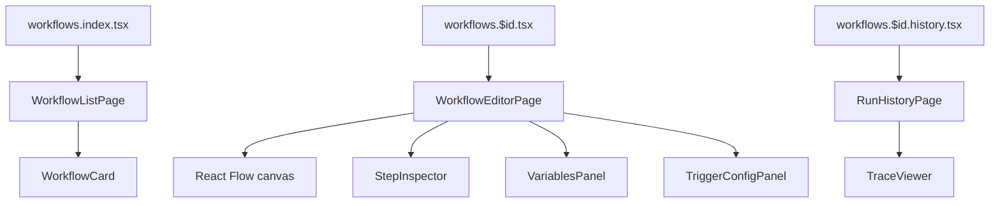

### The step types

> **In plain words:** Seven kinds of step — run an agent, run several in
> parallel, branch on a condition, ask the user for input, transform a variable,
> call a single tool, or run another workflow.

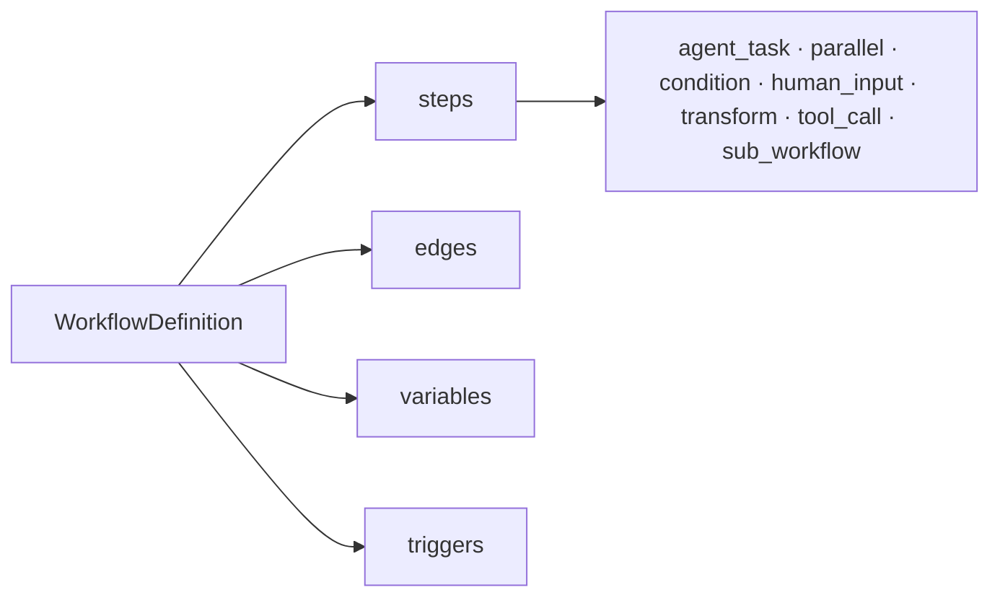

### How it runs

> **In plain words:** The runner walks the flowchart, doing one step at a time,
> saving progress as it goes so a crash or reload doesn't lose where it was. If a
> step fails (or times out), the run stops. Each step's live activity shows in the
> trace view.

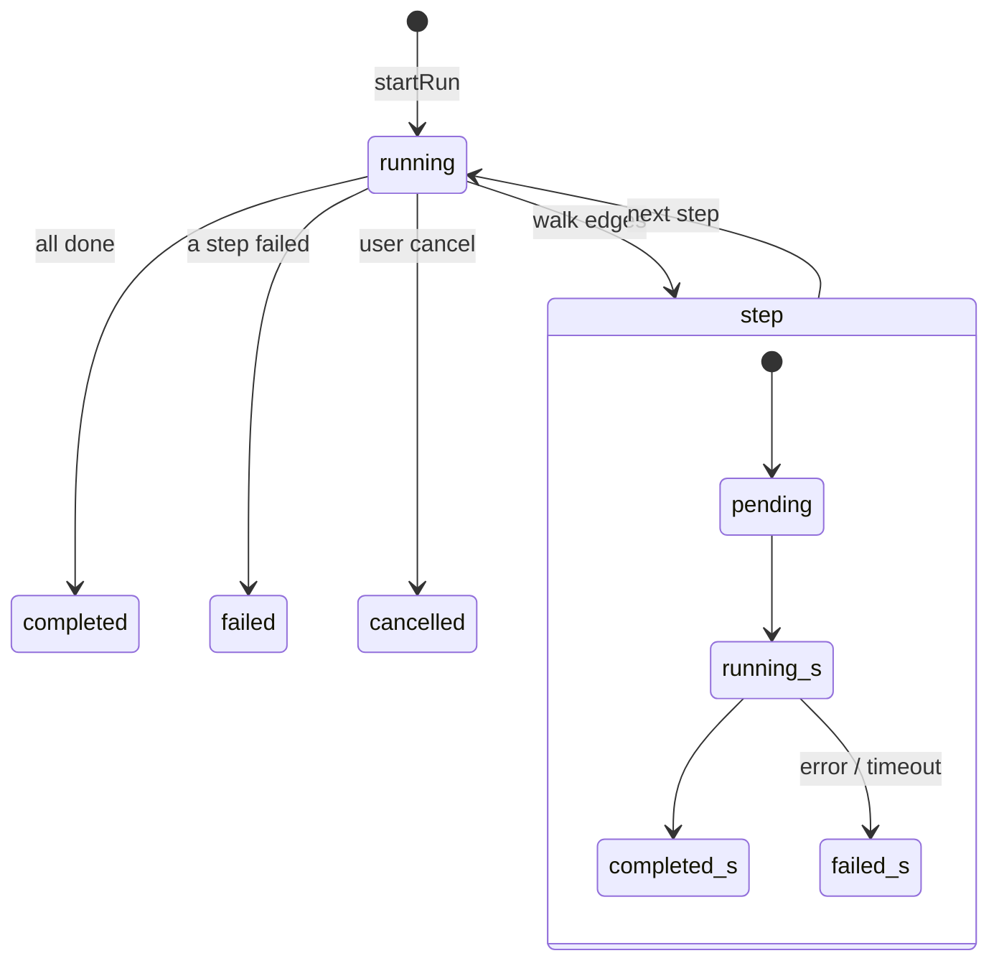

- On boot, `reapOrphanedRuns()` cleans up runs a crash left "running."
- **Trace view** merges three sources: persisted step results, persisted per-round telemetry (`getRunCalls` — so delegation tags survive navigating away), and live events (delegation status + a lite "activity" heartbeat).
- **Touches:** DB `workflows`, `workflow_runs`, `workflow_conversations`, telemetry tables (linked by `run_id`/`step_id`).

---

## View — Knowledge & Library

> **In plain words:** **Knowledge** is the app's memory cabinet — past
> conversations it recalls, documents you've fed it for reference (RAG), reusable
> "how-to" templates, and named document groups. **Library** is a shelf of
> ready-made agents and skills you can drop in.

### Knowledge — four kinds of memory

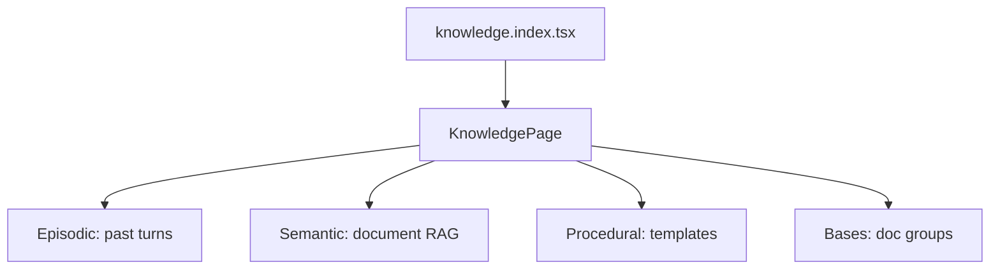

> **In plain words (how a document becomes searchable):** The app reads the file,
> splits it into chunks, turns each chunk into a list of numbers ("embedding")
> that captures its meaning, and stores those so it can later find chunks
> *similar in meaning* to a question.

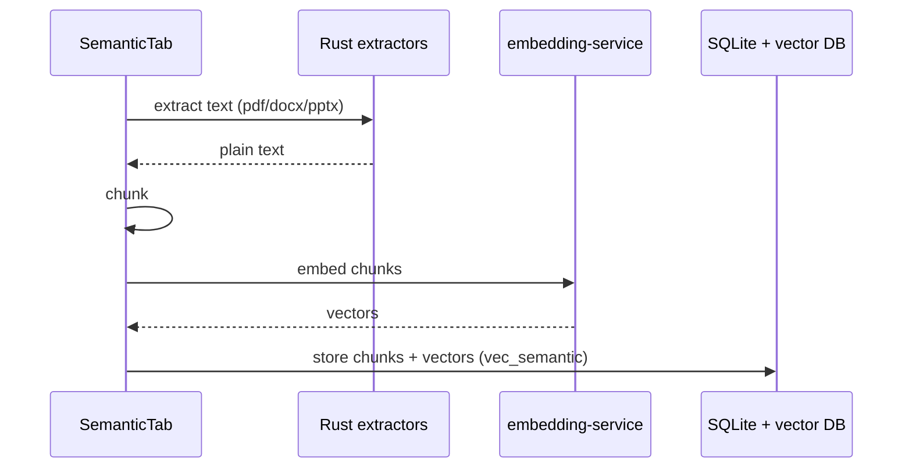

The Knowledge view is the **write/curate** side; agents **read** it during a turn
(`memory-manager.retrieveMemoryContext`). Same embedding model for both, so write
and query share one "meaning space."

### Library — templates seeded from bundled files

> **In plain words:** Built-in agents/skills ship as data files (not hardcoded),
> and are loaded into the database once. If you delete a built-in, it stays
> deleted (it isn't re-added on next launch).

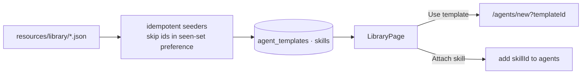

- **Touches:** DB `knowledge_documents`, `document_chunks`, `episodic_memories`, `procedural_templates`, `knowledge_bases(_documents)`, `embedding_config`, `agent_templates`, `skills`; Rust `extract_*`, `vec_upsert`/`vec_search`, embedding worker.

---

## View — Schedules & Settings

> **In plain words:** **Schedules** runs an agent automatically on a timer
> (e.g. every morning), even with no window open. **Settings** is where you add
> AI providers + keys, plug in tool servers (MCP), choose the embedding model,
> set up observability, and tweak preferences.

### Schedules — Rust keeps time, TS does the work

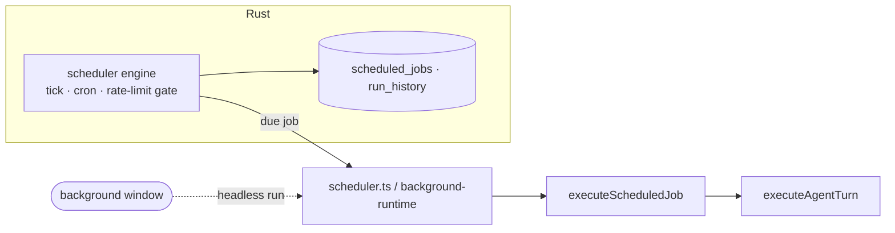

> **In plain words:** Rust is the alarm clock (keeps time, checks you haven't
> blown your token budget); the TypeScript side actually runs the agent when the
> alarm goes off. A hidden background window lets this happen with no visible app.

### Settings

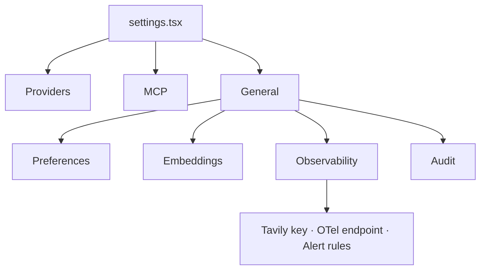

> **In plain words (keys):** When you paste an API key, it goes straight into the
> OS keychain via the Rust side. The screen never gets it back — it can only ask
> "is one set?" That's the one-big-idea in action.

```mermaid
flowchart LR
    UI[paste key] --> ss[secure-store] -->|provider_set_key| reg[Rust Registry] --> kc[(OS Keychain)]
    UI -. provider_has_key .-> bool[configured? bool only]
```

- **MCP servers** (plug-in tool servers) are configured here; their tools register at runtime and become attachable to agents.
- **Touches:** DB `scheduled_jobs`, `schedule_run_history`, `daily_token_usage`, `mcp_servers`, `alert_rules`, `audit_log`; Rust scheduler engine, `Registry`+keychain, `McpRegistry`.

---

## Glossary

| Term | Plain-English meaning |
|---|---|
| **Agent** | A saved AI assistant config: model + instructions + tools + memory settings. |
| **Turn** | One round of an agent doing work: think → maybe use tools → answer. |
| **Tool** | An action an agent can take (read a file, search the web, call another agent). |
| **Delegation** | An agent handing a sub-task to another agent (orchestrator pattern). |
| **Workflow** | A flowchart of steps the app runs automatically. |
| **Provider** | The service that hosts the AI model (OpenRouter, Groq, Ollama, local). |
| **Token** | A chunk of text the model reads/writes; usage + cost are counted in tokens. |
| **Streaming (SSE)** | The model sends its answer word-by-word so you see it as it types. |
| **Episodic memory** | What happened in past turns, recalled when relevant. |
| **Semantic memory / RAG** | Your documents, searched by *meaning* to ground answers. |
| **Procedural memory** | Reusable how-to templates/playbooks. |
| **Embedding** | A numeric fingerprint of text's meaning, used for similarity search. |
| **Vector DB** | The store that finds text "similar in meaning" via embeddings. |
| **MCP** | A standard for plug-in tool servers that extend what agents can do. |
| **Keychain** | The OS secure store where API keys live (never seen by the UI). |
| **IPC** | The private channel between the screen half (TS) and engine half (Rust). |
| **Telemetry** | The recorded log of every AI call/round/tool for the dashboard. |
| **Orphaned run** | A workflow run left "running" by a crash/reload, later cleaned up. |
