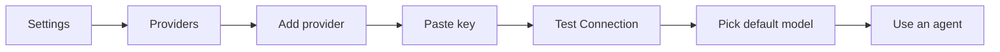
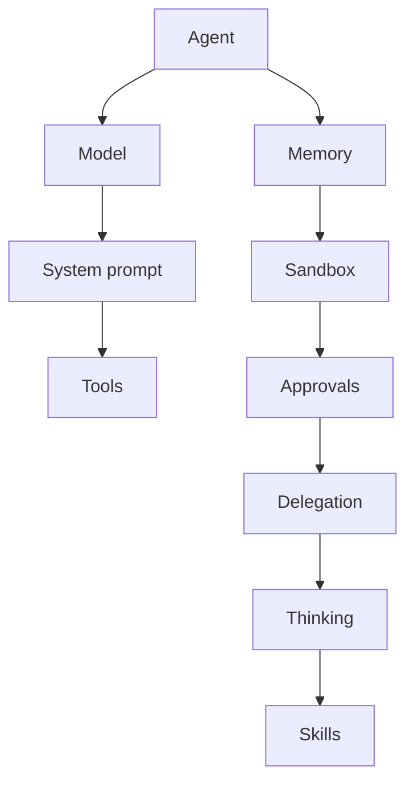
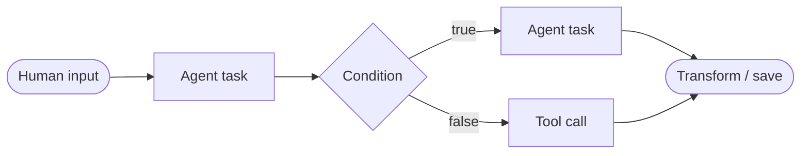
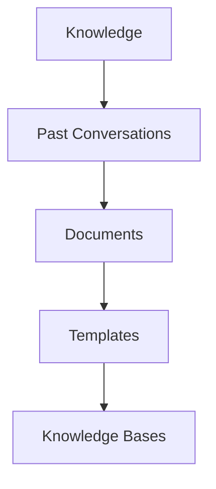
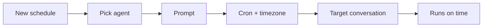

# MatrixOS — User Guide

The complete manual: every screen, every feature, and how to use it. Plain
English; new terms explained on first use. This is the single place to learn
MatrixOS.

## What is MatrixOS?

A desktop app for building and running **AI agents** — assistants you configure
once (model, instructions, tools, memory) and then chat with or run
automatically. Agents can be chained into **workflows** and run on **schedules**.

## Contents
1. [First-time setup](#1-first-time-setup)
2. [Getting around](#2-getting-around)
3. [Chat](#3-chat)
4. [Agents](#4-agents)
5. [Workflows](#5-workflows)
6. [Knowledge (memory)](#6-knowledge-memory)
7. [Library (templates & skills)](#7-library-templates--skills)
8. [Schedules](#8-schedules)
9. [Settings](#9-settings)
10. [Dashboard](#10-dashboard)
11. [Tips & troubleshooting](#11-tips--troubleshooting)

---

## 1. First-time setup

An agent needs an **AI provider** (the service running the model) plus your
**key** (your paid login).



1. Sidebar → **Settings** (gear) → **Providers**.
2. At the bottom, click the dashed **+** for your provider type:

   | Provider | For | Needs |
   |---|---|---|
   | **Anthropic Claude** | Claude models | API key |
   | **OpenAI-Compatible** | OpenRouter, Groq, Together, etc. | API key + Base URL |
   | **Ollama (Local)** | models via local Ollama | Base URL (Ollama running) |
   | **Local (llama.cpp)** | a local llama.cpp server | Base URL (auto-detects model) |

3. Fill the fields (name auto-saves on blur). Paste the **API key** (password
   field — stored securely, never shown again).
4. Click **Test Connection**. On success it turns green "Connected", enables the
   provider, and (for Ollama/OpenAI-compatible/Local) discovers the model list.
5. Pick a **Default Model**. Click **Save**.
6. (Optional, for web search) add a **Tavily** key under **Settings → General →
   Observability**.

Set one provider **Active** with the toggle on its card. You're ready.

---

## 2. Getting around

Left **sidebar** = main menu:
- **Agents** — click one to open a chat.
- **Conversations** (for the selected agent) — **double-click** to rename; hover
  for rename/delete buttons; **+** for a new conversation.
- **Miscellaneous** — Dashboard, Manage Agents, Template Library, Knowledge,
  Schedules, Workflows, Settings.

Collapse a section by clicking its title; each list scrolls on its own.

**Keyboard shortcuts**

| Action | Keys | Action | Keys |
|---|---|---|---|
| New agent | Ctrl+Shift+N | Focus chat box | Ctrl+/ |
| New tab | Alt+N / Alt+T | Toggle sidebar | Ctrl+B |
| Close tab | Alt+W | Settings | Ctrl+, |
| Next / prev tab | Alt+. / Alt+, | Send message | Enter |
| Jump to tab 1–9 | Ctrl+1…9 | Close dialog | Esc |

---

## 3. Chat

1. Click an agent → a chat tab opens.
2. Type, press **Enter** (attach images with the image button — previews show
   above the box).
3. The reply streams live. Blocks you may see:
   - **Thinking** — private reasoning (click to expand).
   - **Tool call** — file read, web search, etc., with its result.
   - **Sources** — "N sources used": documents pulled from Knowledge.
   - **Delegation** — a sub-task handed to another agent.
4. **Tabs:** many at once; a background tab keeps running and flags **needs
   attention** when done.
5. **Tool approval popup:** if the agent asks first, click **Approve**/**Deny**
   per action.

---

## 4. Agents

Sidebar → **Manage Agents**. **New Agent**, or **Use template** (Library) for a
head start. The editor has basics + collapsible sections.



**Basics**

| Field | Meaning / tip |
|---|---|
| Name / Description / Category | Labels for you |
| Provider / Model | Which AI runs it (needs a key) |
| System prompt | Standing instructions — be specific |
| Temperature | 0 = precise, ~1 = creative (0.2 for tools/code) |
| Max tokens / Max history | Output budget; how much past chat it keeps |
| Tools | Switch on abilities (files, web_search, web_fetch, run_shell, etc.) — enable only what's needed |

**Sections**

- **Skills** — header has **Manage Skills / Browse Library** (opens Library to
  attach). Attached skills list lets you reorder (**↑/↓** — order = how they're
  added to the prompt), **Edit**, or **✕ remove** (removes from this agent, not
  the library).
- **Tool approval** — choose a **Mode**: **Always Ask**, **Auto Approve**, or
  **Auto Reject**. **Per-tool overrides** let you set a specific tool to
  default/Auto/Prompt/Deny.
- **Sandbox** — **Enable directory restrictions** (built-in file tools only).
  Add allowed folder paths (type a path → **+ Add**; **✕** removes). Empty list =
  all paths blocked. *MCP tools aren't restricted by this.*
- **Memory** — turn on, choose kinds (past chats / documents / templates), and
  optionally limit to specific knowledge bases or documents. **Off by default.**
- **Thinking** — enable step-by-step reasoning; set a **token budget** slider
  (0 = model default). Temperature locks to 1 when on. Greyed out if the model
  doesn't support it.
- **Delegation** — enable so this agent can hand tasks to others. Pick **allowed
  agents** (pills), **Max depth** (1–5 nested levels), **Max tokens** (per
  delegated call), **Timeout** (10–300 s). Select at least one agent or it stays
  off.

**Save:** edits are kept in memory if you navigate away; click **Save** to
persist. **Export** writes a portable file (behavior + skills, **no key**) — safe
to share; the importer binds it to their own provider.

---

## 5. Workflows

A flowchart of steps the app runs for you. Sidebar → **Workflows** → **+ Create
Workflow** (name + optional description) → opens the canvas.



### Editor toolbar
**← Back** · workflow name + version · **Undo** · **Redo** · **Auto Layout**
(tidy the graph) · **Triggers** (panel) · **Variables** (panel) · **Save** ·
**Publish** (save as active version) · **Run** (saves then runs, jumps to trace).

### Building the graph
1. Left **Steps palette** — click a type to add it; the canvas centers on it.
2. **Connect** steps: drag from a node's **bottom** handle to another's **top**
   handle (the arrow = run order).
3. **Click a node** to edit it in the **Step Inspector** (bottom). Select a node
   → **Delete Selected** appears in the palette to remove it.
4. Drag nodes to reposition (saved).

### Step types & their fields
Every step has **Step Name**, **Error Strategy** (Stop workflow / Skip and
continue / Fallback), and **Timeout (ms)** (blank = use the workflow's max).

| Step | What it does | Key fields |
|---|---|---|
| **Agent task** | Run an agent on a prompt | **Agent** (dropdown), **Prompt** — reference earlier output / variables with `${name}` |
| **Condition** | Branch true/false | **Expression** (e.g. `${count} > 100`). Wire the **green "true"** and **red "false"** bottom handles to the next steps |
| **Parallel** | Run branches at once | (Advanced branch settings aren't exposed yet — only name/error/timeout) |
| **Human input** | Pause and ask you | **Prompt**, **Input type**: Text / Choice / Confirm |
| **Transform** | Reshape/derive a value | **Expression**, **Output Variable** (the name it writes to) |
| **Tool call** | Run one tool directly | **Tool Name**, **Server ID** |
| **Sub-workflow** | Run another workflow | **Workflow ID** |

### Variables (right panel → **Variables**)
**+ Add Variable**, then set **Name**, **Type** (string/number/boolean/object/
array), and a **Default value**. Reference variables in prompts as `${name}`. A
Human-input answer is available as `${stepId}_input`; use a **Transform** step to
rename it to something friendly.

### Triggers (right panel → **Triggers**)
Add a trigger by type, toggle **On/Off**, or **Remove**:
- **Manual** — run with the Run button.
- **Scheduled** — a **cron expression** (e.g. `0 9 * * *` = 9 AM daily; your
  timezone).
- **Event** — fire on an app event (e.g. `conversation:message_added`).

### Running & watching
- From the list, a workflow card shows trigger badges, step count, version, and
  last-run status, with **Edit · Run · History · Delete**.
- **Run History** (per workflow): pick a run on the left (status, who triggered,
  start time, duration); the **Trace** is on the right.
  - **Cancel** (red) appears while a run is **running**.
  - **Resume from failed step** appears on a **failed/cancelled** run — re-uses
    completed steps and restarts from the failure.
- **Trace** per step: status icon, duration, tokens, errors, a live **Activity**
  feed, **Show output** (completed steps), **Show LLM calls** (each round's
  timing/tokens/finish reason), and a **Delegates to** fan-out (sub-agent status,
  nested rounds).
- **Human input:** when a run hits one, a **"Workflow needs input"** popup shows
  the prompt. Type text (a **Browse…** button appears for file/folder prompts),
  pick a Choice, or Confirm Yes/No. **Cancel run** stops the whole workflow.

---

## 6. Knowledge (memory)

Sidebar → **Knowledge** ("Knowledge Base"). Four tabs. *Documents and Past
Conversations need an embedding model (Settings → General → Embeddings) — the
built-in one works with no setup.*



### Past Conversations (episodic)
Search past chats by meaning: type a query, optionally filter by **agent**,
**Search**. Each result shows a relevance score + date; **Pin/Unpin** (keep it
handy) or **Forget** (delete it).

### Documents (semantic / RAG — reference material)
- **Import Documents** — native file picker, multi-select. Supported: pdf, docx,
  pptx, md, txt, and code (ts/tsx/js/jsx/py/rs/go); anything else = plain text.
  Files process one by one with a live progress label; **Cancel** aborts the
  rest.
- Each document row: chunk/token counts, **Re-import** (re-read the source file)
  and **Delete**.
- **Re-embed All** — rebuild the search index for all documents (use after
  changing the embedding model, or if searches return nothing).
- **Test Search** — type a query to preview which chunks match.

### Templates (procedural)
Reusable prompt patterns. **+ New Template** → **Name**, **Description**,
**Category**, **Content**. Edit/Delete per row; a "Used N times" counter shows
usage.

### Knowledge Bases (document groups)
**+ New Knowledge Base** → **Name** + **Description**. Per card: **Manage Docs**
(add/remove member documents), **Edit**, **Delete**. Point an agent at a specific
base via the agent's Memory section.

**To give an agent memory:** Agent editor → **Memory** → enable → choose kinds /
bases → Save. You'll then see the **Sources** block in chat when documents are
used.

---

## 7. Library (templates & skills)

Sidebar → **Template Library**. **Search** + **category chips** filter the active
tab. Two tabs:

### Agent Templates
Reusable agent presets. **+ Create Agent Template**:

| Field | Notes |
|---|---|
| Name / Description | Card labels |
| Category | Typeahead; free text allowed |
| Icon | Pick from a list |
| System Prompt | The prompt agents made from this template start with |
| Temperature | Slider 0–1 |
| Max Tokens / Max History | 0 = model decides; history default 50 |
| Tags | Comma-separated |

Each card has **Use Template** → opens **New Agent** pre-filled. (No edit/delete
on agent-template cards in this view.)

### Skills (reusable prompt add-ons)
**+ Create Skill** → **Name** + **Prompt** (the snippet appended to an agent's
system prompt). Per skill card:
- **Attach to agents…** — dialog with a checkbox list of all agents; tick to
  attach/untick to detach (saves immediately).
- **Edit** / **Delete** (delete asks to confirm; it's removed from agents that
  use it and won't return).
- **Update** — appears if a newer bundled version exists.
- **Add** — appears only when you opened the Library from an agent editor's "add
  skills" link (attaches to that agent/draft).

**Add a new skill template:** Skills tab → **+ Create Skill** → Name + Prompt →
**Create** → **Attach to agents…**.
**Add a new agent template:** Agent Templates tab → **+ Create Agent Template** →
fill fields → **Create Template** → **Use Template** to spin up an agent.
*(There's no import/export of templates/skills in the Library; built-ins are
seeded by the app.)*

---

## 8. Schedules

Sidebar → **Schedules** ("Scheduled Agents") → **+ Create Schedule**.



**Editor fields**

| Field | Notes |
|---|---|
| **Agent** | Which agent runs |
| **Cron expression** | Quick-pick chips (every minute/30 min/hour/9 am daily/Mon 8 am) or a custom cron; a plain-English description confirms it |
| **Timezone** | Defaults to yours |
| **Prompt** | What the agent does each run (required) |
| **Target conversation** | "Create new each time" (default) or append to an existing conversation |

**Each schedule card:** prompt, **Running/Paused** badge, agent, schedule
(readable), timezone, last/next run, last error. Buttons: **Run Now**, **Edit**,
**Pause/Resume** (this is the enable/disable), **Delete**.

To run with the window closed, enable **"keep running in background"** (Settings →
General → Preferences).

---

## 9. Settings

### Providers
Cards per provider (see [setup](#1-first-time-setup)). Per card: edit **Name**,
**API Key** (replace only), **Base URL**, **Default Model**; **Test Connection**
(validates + enables + discovers models), **Save**, **Remove** (trash), and the
**Set Active** toggle.

### MCP (plug-in tool servers)
**+ Add Server**:
- **Name**; **Transport** = **stdio** (a **Command** + **Arguments** — a
  confirmation shows the exact command and warns it runs with the app's access)
  or **HTTP** (a **URL**).
After adding, the row shows a live **status** (ready/error/connecting) and "N
tools discovered"; those tools then appear in agents' tool lists. **Restart** /
**Delete** per row.

### General → Preferences
**Theme** (System/Dark/Light), **Keep MatrixOS running when window is closed**
(tray + background; takes effect next launch), and the keyboard-shortcut
reference.

### General → Embeddings
**Provider** (Built-in / Ollama / OpenAI-compatible), **Model** (presets show
dimensions), **Dimensions** (64–4096), optional **Base URL**. **Save Embedding
Config**. ⚠ Changing **dimensions rebuilds the vector store and deletes all
existing embeddings** — you'll need to re-embed documents/memories.

### General → Observability
- **Web Search (Tavily)** — paste the key (password; shows "✓ configured"),
  **Save**. Required for `web_search`.
- **OpenTelemetry Export** — an OTLP/HTTP endpoint to send app events to a
  monitoring tool; empty = off (takes effect next launch).
- **Alert Rules** — **Add** a rule: optional **Label**, an **Event type** (e.g.
  `workflow:run_failed`), and an **Action** (Toast/Notify). Toggle the checkbox
  to enable/disable, **Delete** to remove. A matching event then pops a toast.

### General → Audit Log
Read-only table of sensitive actions (provider keys set/deleted, tools
executed/approved/rejected, agents created/updated/deleted, conversations
exported). Filter by event type; paginated (50/page).

> **Security:** all keys (providers, Tavily, MCP) live in your OS keychain. The
> app confirms a key exists but never shows it again. Background mode and the
> OTel endpoint take effect on next launch.

---

## 10. Dashboard

Home screen (chart icon). Pick a **time range** (top-right) to scope everything.

- **Stat cards:** requests, tokens, average speed, error rate, **estimated cost**.
- **Charts:** requests and tokens over time.
- **Agent breakdown:** usage + cost per agent.
- **Failure breakdown:** *why* calls failed (errors / hitting output limits) —
  first stop when something misbehaves.
- **Recent Requests:** click a row to inspect the exact prompt/response, view each
  **round**, or **Re-run** against another model (indicative — omits the original
  system prompt). Columns show the **agent** and **workflow**.
- **Tool Calls:** every tool run; click for inputs/outputs and whether the sandbox
  allowed it.

---

## 11. Tips & troubleshooting

- **Web search does nothing:** add a **Tavily** key (Settings → General →
  Observability).
- **An agent keeps failing / a workflow loops:** check **Dashboard → Failure
  Breakdown** + **Tool Calls** for the real reason. Common: a free provider
  overloaded (add a **fallback provider** to the agent, or use a paid tier) or a
  model hitting its output limit (use a more capable model).
- **It doesn't remember anything:** memory is **off by default** — enable it per
  agent (Agent editor → Memory).
- **Document search returns nothing:** try **Re-embed All**, or check your
  embedding model in Settings → Embeddings.
- **Changed a model/setting and nothing happened:** restart the app — some
  settings load at startup (background mode, OTel endpoint).
- **A scheduled run was skipped:** you may have hit a token rate limit — see the
  schedule's run history.
- **Approval popups while testing:** set the agent's tool approval to **Auto
  Approve** once you trust it.
- **Sharing agents is safe:** exports never include your API keys.
```

